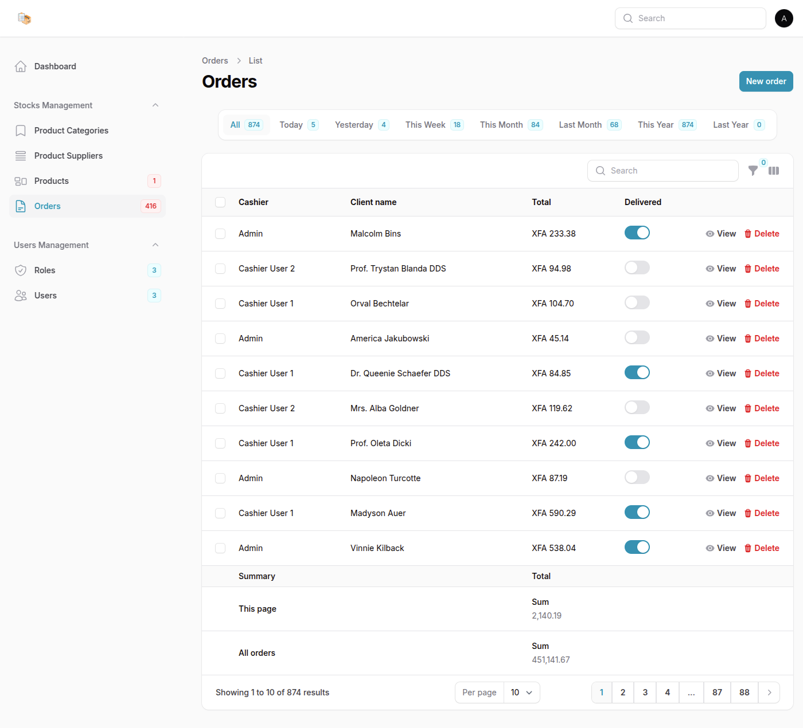

# 📦 StockX – Stocks Management System  

**StockX** is a powerful and intuitive inventory management solution built with **Laravel** and **FilamentPHP**, designed to streamline your stock, orders, suppliers, and user roles—all in one place. Whether you're managing a warehouse, a small business, or a large-scale operation, StockX provides all the tools you need to keep your inventory under control.

## 🚀 Key Features

### 📦 Inventory Management
- **Product Categories** – Create, update, soft-delete, and manage product categories.
- **Suppliers** – Maintain supplier records with full CRUD capabilities.
- **Products** – Track products with key details like quantity, supplier, pricing, and category.

### 📑 Order Management
- **Order Handling** – Create and manage orders with automatic stock validation and dynamic inventory updates.
- **Stock Validation** – Ensure product availability during order processing.
- **Low Stock Alerts** – Email notifications when stock dips below a set threshold.

### 👥 User & Role Management
- **User Admin** – Create, edit, and manage users with role assignments.
- **Role-Based Access Control (RBAC)** – Fine-tuned permission handling with **Filament Shield**.

### 🔔 Notifications
- **Low Stock Emails** – Automatic alerts to notify admins when stock is low.

### 📊 Dashboard & Analytics
- **Interactive Charts** – Visualize sales and inventory trends.
- **Quick Stats** – Glance at total users, products, orders, and alerts.

### 🧭 Global Search
- **Smart Search** – Look up products, orders, and suppliers with rich result details.
- **Quick Navigation** – Jump straight to the item’s page from search results.

### 🔍 Filters & Tabs
- **Order Filters** – Filter by custom timeframes like today, this week, or this year.
- **Supplier Tabs** – Organize suppliers by product categories.

### 🔐 Authentication & Security
- **Secure Login** – Full auth system with email verification.
- **Permissions System** – Restrict access by user roles for enhanced security.

## 🖼️ Screenshots

Here’s a quick peek at what StockX looks like in action:

- **Dashboard**  
  .png)
  .png)

- **Products**  
  .png)
  .png)

- **Orders**  
  .png)
  

- **Create Order**  
  .png)

- **Roles**  
  .png)

- **Edit Role**  
  .png)

- **Email Notification (Low Stock)**  
  


## ⚙️ Deployment Guide

### 📋 Prerequisites

You only need **Docker** and **Docker Compose** installed on your system. All other dependencies (PHP, Composer, Node.js, MySQL, etc.) are handled inside containers.

- **Docker** ≥ 20.10
- **Docker Compose** ≥ 1.29

> If you prefer manual installation, see the [Manual Setup](#manual-setup) section below.

### 🐳 Docker Deployment (Recommended)

#### 1. Clone the Repository
```bash
git clone https://github.com/abogo-nono/StocksX.git
cd StocksX
```

#### 2. Copy and Configure Environment Variables
```bash
cp .env.example .env
# Edit .env as needed (DB, mail, etc.)
```

#### 3. Build and Start the Containers
```bash
docker-compose up --build -d
```

- This will build the app container, set up MySQL, and run all necessary services.
- All dependencies are installed automatically inside the containers.

#### 4. Run Migrations, Seeders, and Setup Commands
```bash
docker-compose exec app php artisan migrate --seed
docker-compose exec app php artisan storage:link
docker-compose exec app php artisan make:filament-user
docker-compose exec app php artisan shield:install --fresh
docker-compose exec app php artisan shield:generate --all
docker-compose exec app php artisan shield:super-admin --user=1
```

#### 5. Access the Application
- Visit [http://localhost:9000](http://localhost:9000) (or the port you mapped)

---

### 🛠️ Manual Setup (For Development/Advanced Users)

If you want to run the app without Docker, follow these steps:

#### Prerequisites
- **PHP** ≥ 8.2  
- **Composer** ≥ 2.3  
- **Node.js** ≥ 18.8  
- **NPM** ≥ 8.18  
- **MySQL** ≥ 8.0  
- **Mailpit** – For testing email notifications  

#### Installation Steps

1. Install dependencies:
```bash
composer install
npm install
```
2. Build frontend assets:
```bash
npm run build
```
3. Set up `.env` and database as described above.
4. Run migrations, seeders, and setup commands as above.
5. Start the Laravel server:
```bash
php artisan serve
```
6. (Optional) Start Vite dev server for hot reload:
```bash
npm run dev
```

<!-- ## 📈 Repository Traffic -->

<!-- - **Stars:** 
- **Forks:**  -->


## 🤝 Feedback & Contributions

We’d love to hear your thoughts!  
- 🐛 Found a bug? [Open an issue](https://github.com/abogo-nono/StocksX/issues)  
- 🌟 Got a feature idea? Share it or [submit a pull request](https://github.com/abogo-nono/StocksX/pulls)

## 📄 License

This project is open-source and available under the **[MIT License](LICENSE)**.
